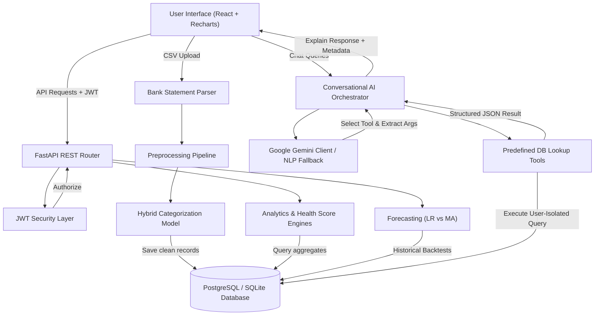
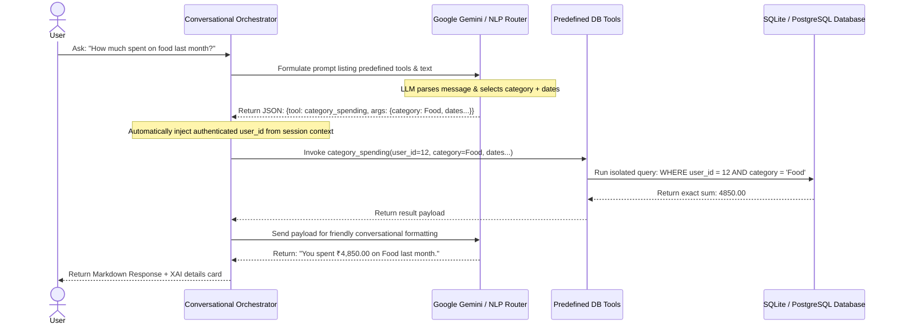

# CashFlow AI System Architecture

This document maps the architectural flow of **CashFlow AI**, illustrating user authentication, ledger ingestion preprocessing, hybrid categorization ML triggers, predictive budgeting pipelines, and secure database-backed Conversational AI tool orchestration.

## 1. Overall System Architecture Diagram

---

## 2. Ingestion & Classification Pipeline

1. **Bank Statement**: File is validated as CSV.
2. **Preprocessing**: Normalized text descriptions, parsed amounts, identified types (Debit/Credit), date format alignment, and weekend indicators.
3. **Layer 1 Rules**: High-confidence keyword matching (Regex mappings) are checked. Hits return category instantly with confidence 1.0.
4. **Layer 2 ML Model**: Misses trigger TF-IDF + Logistic Regression classification. Confidence values > 0.45 are saved, else fallback to standard defaults.
5. **Corrections retrainer**: User category modifications log feedback coordinates in the database to enable retrains.

---

## 3. Conversational AI Security Matrix

To prevent prompt injection bypasses and database leakage, the chatbot orchestrator restricts LLMs from generating raw SQL:

